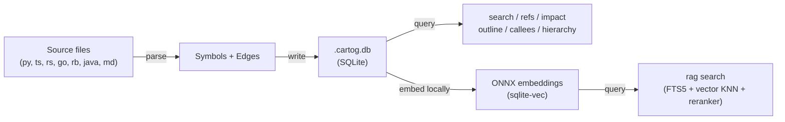

# Cartog

[](https://github.com/jrollin/cartog/actions/workflows/ci.yml)
[](https://codecov.io/gh/jrollin/cartog)
[](https://crates.io/crates/cartog)
[](https://crates.io/crates/cartog)
[](https://github.com/jrollin/cartog)
[](LICENSE)

**Map your codebase. Navigate by graph, not grep.**

Single binary. Microsecond queries. 100% local.

Cartog pre-computes a code graph — symbols, calls, imports, inheritance — and lets you query it instantly. Use it from the CLI for day-to-day navigation, as an MCP server for AI agents, or both. No Python, no pip, no Docker. One binary, one SQLite file, zero cloud dependencies.

> **[Documentation site](https://jrollin.github.io/cartog/)**


## Quick Start

```bash
cargo install cartog          # or download a binary from GitHub Releases
cd your-project
cartog index .                # build the graph (~95ms for 4k LOC)
```

That's it. Now query:

```bash
cartog search validate        # find symbols by name         (sub-ms)
cartog refs validate_token    # who calls this?              (< 500 us)
cartog impact validate_token  # what breaks if I change it?  (< 20 ms)
cartog outline src/auth.py    # file structure, no cat       (< 15 us)
```

## Why Cartog

Every code navigation tool makes you choose: fast but shallow (grep), or precise but slow (language servers). Cartog gives you both.

| | grep / cat / find | Language servers | **Cartog** |
|---|---|---|---|
| **Query speed** | depends on codebase size | seconds to start | **8-450 us** |
| **Transitive analysis** | impossible | partial | **`impact --depth 5`** |
| **Setup** | none | per-language config | **one binary, zero config** |
| **Languages** | all (text) | one per server | **8 languages, one tool** |
| **Token cost** (LLM context) | ~1,700 tokens/query | n/a | **~280 tokens/query** |
| **Recall** (completeness) | 78% | ~100% | **97%** [*](#benchmark-notes) |
| **Privacy** | local | local | **100% local** |

Measured across 13 scenarios, 5 languages ([benchmark suite](crates/cartog/benches/queries.rs)).

<a id="benchmark-notes"></a>
> **\*** 97 % recall requires a matching language server on PATH. The
> default build ships LSP support; heuristic-only resolution (no server
> found, or `--no-lsp`) lands around 25–37 %, with specifics varying by
> language.

## What You Get

### Fast structural queries

Pre-computed graph means no re-reading files, no multi-step discovery.

```bash
cartog search parse              # symbol name lookup (sub-ms)
cartog refs UserService          # all callers, importers, inheritors
cartog callees authenticate      # what does this function call?
cartog impact SessionManager     # blast radius — callers-of-callers, depth N
cartog hierarchy BaseService     # inheritance tree
cartog deps src/routes/auth.py   # file-level imports
cartog changes --commits 5       # symbols affected by recent git commits
cartog map --tokens 4000         # codebase overview, ranked by centrality
```

### Semantic search (optional, still fully local)

```bash
cartog rag setup                 # download models (~1.2 GB, one-time)
cartog rag index .               # embed symbols + docs into sqlite-vec
cartog rag search "authentication token validation"
```

Three-tier hybrid pipeline: **FTS5 keyword** + **vector KNN** + **cross-encoder re-ranking**. Indexes both code (functions, classes, methods) and Markdown documents. Models run locally via ONNX Runtime — no API keys, no network calls.

> **Prefer Ollama?** Set `provider = "ollama"` in `.cartog.toml`. See [Configuration](#configuration).

### Live index

```bash
cartog watch .                   # auto re-index on file changes
cartog watch . --rag             # also re-embed (deferred, non-blocking)
```

### MCP server for AI agents

```bash
cartog serve                     # 12 tools over stdio
cartog serve --watch --rag       # with live re-indexing + semantic search
```

Works with Claude Code, Cursor, Windsurf, Zed, OpenCode — any MCP client.

### LSP precision, built in

Cartog auto-detects language servers on PATH (rust-analyzer, pyright, typescript-language-server, gopls, ruby-lsp, solargraph, jdtls) and uses them to boost edge resolution from ~25% to **up to 81%**. Enabled by default; results persist in SQLite — pay the cost once. Disable at runtime with `--no-lsp`, or omit at build time with `cargo install cartog --no-default-features`.

## Install

### From crates.io

```bash
cargo install cartog                                  # default (includes LSP)
cargo install cartog --no-default-features            # minimal, no LSP
cargo install cartog --features ollama-embedding      # + Ollama support
```

### Pre-built binaries

```bash
# macOS (Apple Silicon)
curl -L https://github.com/jrollin/cartog/releases/latest/download/cartog-aarch64-apple-darwin.tar.gz | tar xz
sudo mv cartog /usr/local/bin/

# macOS (Intel)
curl -L https://github.com/jrollin/cartog/releases/latest/download/cartog-x86_64-apple-darwin.tar.gz | tar xz
sudo mv cartog /usr/local/bin/

# Linux (x86_64)
curl -L https://github.com/jrollin/cartog/releases/latest/download/cartog-x86_64-unknown-linux-gnu.tar.gz | tar xz
sudo mv cartog /usr/local/bin/

# Linux (ARM64)
curl -L https://github.com/jrollin/cartog/releases/latest/download/cartog-aarch64-unknown-linux-gnu.tar.gz | tar xz
sudo mv cartog /usr/local/bin/

# Windows (x86_64) — download .zip from releases page
```

### Upgrade

Once cartog is on your `PATH`:

```bash
cartog self update           # upgrade in place to the latest stable
cartog self update --check   # report whether an update exists; exit 1 if outdated
cartog self version          # show installed version + last-check timestamp
cartog self rollback         # restore the previous binary
```

Cargo-installed binaries upgrade with `cargo install cartog --force`. See [docs/updates.md](docs/updates.md) for env vars, exit codes, and the state file location.

### Claude Code plugin

Run these two commands **one at a time** in Claude Code:

```bash
/plugin marketplace add jrollin/cartog
```

```bash
/plugin install cartog@cartog-plugins
```

### Agent Skill (Cursor, Copilot, others)

```bash
npx skills add jrollin/cartog
```

## Why Not...

**grep/ripgrep?** Great for string literals and config values. But grep can't trace call chains, can't do transitive impact analysis, and floods your context with raw text. Cartog returns structured, ranked, deduplicated results — one `refs` call replaces 6+ discovery steps.

**A language server?** LSPs give perfect precision but require per-language setup, take seconds to start, and only cover one language at a time. Cartog covers 8 languages with one binary and answers in microseconds. When you need LSP precision, cartog can use it as an optional layer.

**Python-based graph tools?** They solve a similar problem but require a Python runtime, pip dependencies, and virtual environments. Cartog is a single static binary — download and run. It also queries 10-100x faster thanks to compiled Rust + SQLite.

## MCP Server Setup

```bash
# Claude Code
claude mcp add cartog -- cartog serve --watch --rag
```

For other clients, add to your MCP config:

```json
{
  "mcpServers": {
    "cartog": {
      "command": "cartog",
      "args": ["serve", "--watch", "--rag"]
    }
  }
}
```

See [Usage — MCP Server](docs/usage.md#mcp-server) for per-client details (Cursor, Windsurf, Zed, OpenCode).

## Commands

```bash
# Index
cartog index .                              # build the graph (with LSP if available)
cartog index . --no-lsp                     # heuristic-only (~1-4s)
cartog index . --force                      # re-index all files

# Search
cartog search validate                      # partial name match (sub-ms)
cartog search validate --kind function      # filter by kind
cartog rag search "token validation"        # semantic search (natural language)

# Navigate
cartog outline src/auth/tokens.py           # file structure without reading it
cartog refs validate_token                  # who references this?
cartog refs validate_token --kind calls     # only call sites
cartog callees authenticate                 # what does this call?
cartog impact SessionManager --depth 3      # what breaks if I change this?
cartog hierarchy BaseService                # inheritance tree
cartog deps src/routes/auth.py              # file-level imports

# Inspect
cartog stats                                # index summary
cartog map --tokens 4000                    # codebase overview by centrality
cartog changes --commits 5                  # recently changed symbols
cartog doctor                               # environment health check

# Watch & Serve
cartog watch .                              # auto re-index on save
cartog serve --watch --rag                  # MCP server with live index
```

All commands support `--json` for structured output and `--tokens N` for budget-aware output.

<details>
<summary><strong>Example outputs</strong></summary>

### outline

```
$ cartog outline auth/tokens.py
from datetime import datetime, timedelta  L3
from typing import Optional  L4
import hashlib  L5
class TokenError  L11-14
class ExpiredTokenError  L17-20
function generate_token(user: User, expires_in: int = 3600) -> str  L23-27
function validate_token(token: str) -> Optional[User]  L30-44
function lookup_session(token: str) -> Optional[Session]  L47-49
function refresh_token(old_token: str) -> str  L52-56
function revoke_token(token: str) -> bool  L59-65
```

### search

```
$ cartog search validate
function  validate_token    auth/tokens.py:30
function  validate_session  auth/tokens.py:68
function  validate_user     services/user.py:12
```

### impact

```
$ cartog impact validate_token --depth 3
  calls  get_current_user  auth/service.py:40
  calls  refresh_token  auth/tokens.py:54
    calls  impersonate  auth/service.py:52
```

### refs

```
$ cartog refs UserService
imports  ./service  routes/auth.py:3
calls    login  routes/auth.py:15
inherits AdminService  auth/service.py:47
references  process  routes/auth.py:22
```

</details>

## Supported Languages

| Language | Extensions | Symbols | Edges |
|----------|-----------|---------|-------|
| Python | .py, .pyi | functions, classes, methods, imports, variables | calls, imports, inherits, raises, type refs |
| TypeScript | .ts, .tsx | functions, classes, methods, imports, variables | calls, imports, inherits, type refs, new |
| JavaScript | .js, .jsx, .mjs, .cjs | functions, classes, methods, imports, variables | calls, imports, inherits, new |
| Rust | .rs | functions, structs, traits, impls, imports | calls, imports, inherits (trait impl), type refs |
| Go | .go | functions, structs, interfaces, imports | calls, imports, type refs |
| Ruby | .rb | functions, classes, modules, imports | calls, imports, inherits, raises, rescue types |
| Java | .java | classes, interfaces, enums, methods, imports | calls, imports, inherits, raises, type refs, new |
| Markdown | .md | document sections (chunked by heading) | — |

## How It Works



1. **Index** — tree-sitter parses your code, extracts symbols (functions, classes, methods) and edges (calls, imports, inherits, type refs). Markdown is chunked by heading.
2. **Store** — everything goes into a local `.cartog.db` SQLite file.
3. **Resolve (heuristic)** — links edges by name with scope-aware matching.
4. **Resolve (LSP, optional)** — sends unresolved edges to language servers for compiler-grade precision. Results persist.
5. **Embed (optional)** — generates vector embeddings via local ONNX or Ollama, stored in sqlite-vec.
6. **Query** — instant lookups against the pre-computed graph. Hybrid FTS5 + vector search with RRF merge and cross-encoder re-ranking.

Re-indexing is incremental: git diff + SHA-256 skips unchanged files, Merkle-tree diffing updates only modified symbols. `cartog watch` automates this on file save.

## Performance

Indexing: **69 files / 4k LOC in 95ms** (incremental re-index skips unchanged files).

| Query | Latency |
|-------|---------|
| outline | 8-14 us |
| hierarchy | 8-9 us |
| deps | 25 us |
| stats | 32 us |
| search | 81-102 us |
| callees | 177-180 us |
| refs | 258-471 us |
| impact (depth 3) | 2.7-17 ms |

### Edge Resolution

| Project | Language | Heuristic | With LSP | LSP time |
|---------|----------|-----------|----------|----------|
| TS microservice (230 files) | TypeScript | 37% | **81%** | 13s |
| Vue.js SPA (739 files) | Vue/TS/JS | 31% | **72%** | 25s |
| Rust CLI (358 files) | Rust | 25% | **44%** | 72s |

Unresolved edges are mostly calls to external libraries outside the project boundary.

## Configuration

Database path is resolved automatically — no config needed for standard use:

1. `--db` flag / `CARTOG_DB` env var (highest priority)
2. `.cartog.toml` at git root
3. Auto git-root detection
4. `.cartog.db` in current directory

**`.cartog.toml`** (optional):

```toml
[database]
path = "~/.local/share/cartog/myproject.db"

[embedding]
provider = "ollama"          # "local" (default) or "ollama"
model = "nomic-embed-text"

[embedding.ollama]
base_url = "http://localhost:11434"

[reranker]
provider = "none"            # "local" (default) or "none"
```

## Privacy

- **Parsing**: tree-sitter runs in-process
- **Storage**: SQLite file in your project directory
- **Embeddings**: local ONNX or Ollama on localhost
- **Re-ranking**: cross-encoder runs locally via ONNX
- **MCP server**: stdio only, no network sockets
- **No telemetry**, no analytics, no phone-home

Your code never leaves your machine.

## Documentation

Full index: [docs/README.md](docs/README.md). Highlights:

- **[Documentation site](https://jrollin.github.io/cartog/)** — quick start, CLI reference, configuration, MCP setup
- [Usage](docs/usage.md) — full CLI reference and integration guides
- [Editor integration](docs/editor-integration.md) — Neovim, VS Code, Emacs recipes
- [Troubleshooting](docs/troubleshooting.md) — common issues and fixes
- [Product Overview](docs/product.md) — vision, target users, benchmark caveats
- [Technology Stack](docs/tech.md) — architecture and RAG design
- [Project Structure](docs/structure.md) — workspace layout

## License

MIT
