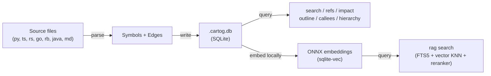

# Cartog

[](https://github.com/jrollin/cartog/actions/workflows/ci.yml)
[](https://codecov.io/gh/jrollin/cartog)
[](https://crates.io/crates/cartog)
[](https://crates.io/crates/cartog)
[](https://github.com/jrollin/cartog)
[](LICENSE)

**Map your codebase. Navigate by graph, not grep.**

Cartog pre-computes a code graph — symbols, calls, imports, inheritance — and lets you query it in microseconds. Use it from the CLI, as an MCP server for AI agents, or both. Everything runs locally: no API calls, no cloud, no data leaves your machine.

> **[Documentation site →](https://jrollin.github.io/cartog/)**

## Why Cartog

| | grep/cat/find | Cartog |
|---|---|---|
| **Query latency** | multi-step | 8-450 μs |
| **Recall** (completeness) | 78% | 97% |
| **Transitive analysis** | impossible | `impact --depth 3` traces callers-of-callers |
| **Semantic search** | no | local ONNX / Ollama |
| **Privacy** | local | **100% local** — no remote calls |

Measured across 13 scenarios, 5 languages ([full benchmark suite](benchmarks/)).

### What you get

- **Single binary, self-contained** — `cargo install cartog` and you're done. No Docker, no config.
- **100% local** — tree-sitter parsing + SQLite storage + local embeddings. Your code never leaves your machine.
- **Dual search** — keyword search (sub-ms, symbol names) and semantic search (natural language). Configurable embedding providers (local ONNX or [Ollama](https://ollama.com)).
- **Impact analysis** — `cartog impact --depth 3` traces callers-of-callers. Know the blast radius before you change anything.
- **Live index** — `cartog watch` auto re-indexes on file changes. Always query fresh data.
- **Optional LSP precision** — auto-detects language servers on PATH to boost edge resolution from ~25% to ~42-81%.

### For LLM agents

- **MCP server** — `cartog serve` exposes 12 tools over stdio. Plug into Claude Code, Cursor, Windsurf, Zed, or any MCP-compatible agent.
- **Agent skill** — teaches your agent when and how to use Cartog. Search routing, refactoring workflows, fallback heuristics.
- **Token efficient** — 83% fewer tokens per query vs grep/cat workflows. One `refs` call replaces 6+ discovery steps.


## Quick Start

```bash
cargo install cartog
cd your-project
cartog index .               # build the graph (~95ms for 4k LOC, incremental)
cartog search validate       # find symbols by name (sub-millisecond)
cartog refs validate_token   # who calls/imports/references this?
cartog impact validate_token # what breaks if I change this?
```

### Add semantic search (optional, still fully local)

```bash
cartog rag setup             # download embedding + re-ranker models (~1.2GB, one-time)
cartog rag index .           # embed all symbols + documents into sqlite-vec
cartog rag search "authentication token validation"   # natural language queries
```

Indexes both **code** (functions, classes, methods) and **Markdown documents** (READMEs, design docs, API docs). Returns code by default; use `--kind document` for docs or `--kind all` for both.

Models are downloaded once to `~/.cache/cartog/models/` and run locally via ONNX Runtime. No API keys, no network calls at query time.

> **Using Ollama instead?** Configure `.cartog.toml` with `[embedding] provider = "ollama"` and skip `rag setup` — models are managed by Ollama. See [Configuration](#configuration).

## Install

### From crates.io

```bash
cargo install cartog                    # core (heuristic resolution only)
cargo install cartog --features lsp     # + LSP-based resolution (recommended)
cargo install cartog --features ollama-embedding  # + Ollama embedding support
```

The `lsp` feature adds ~50KB to the binary. It auto-detects language servers on PATH (rust-analyzer, pyright, typescript-language-server, gopls, ruby-lsp, solargraph) and uses them to resolve edges that heuristic matching can't. No extra config needed — if a server is on PATH, it's used automatically.

### Pre-built binaries

Download from [GitHub Releases](https://github.com/jrollin/cartog/releases/latest):

```bash
# macOS (Apple Silicon)
curl -L https://github.com/jrollin/cartog/releases/latest/download/cartog-aarch64-apple-darwin.tar.gz | tar xz
sudo mv cartog /usr/local/bin/

# macOS (Intel)
curl -L https://github.com/jrollin/cartog/releases/latest/download/cartog-x86_64-apple-darwin.tar.gz | tar xz
sudo mv cartog /usr/local/bin/

# Linux (x86_64)
curl -L https://github.com/jrollin/cartog/releases/latest/download/cartog-x86_64-unknown-linux-gnu.tar.gz | tar xz
sudo mv cartog /usr/local/bin/

# Linux (ARM64)
curl -L https://github.com/jrollin/cartog/releases/latest/download/cartog-aarch64-unknown-linux-gnu.tar.gz | tar xz
sudo mv cartog /usr/local/bin/

# Windows (x86_64) — download .zip from releases page
```

## Configuration

The database path is resolved automatically — no config needed for standard use:

1. **`--db` flag / `CARTOG_DB` env var** — explicit override (highest priority)
2. **`.cartog.toml`** at the git root — project-specific config
3. **Auto git-root detection** — DB placed at the root of the git repository
4. **cwd fallback** — `.cartog.db` in the current directory

```bash
# Override database location
cartog --db /tmp/myproject.db index .
CARTOG_DB=~/.local/share/cartog/proj.db cartog search foo

# --db is global — applies to all subcommands
cartog --db /tmp/x.db stats
```

**`.cartog.toml`** (optional, place at project root):
```toml
[database]
path = "~/.local/share/cartog/myproject.db"

# Embedding provider (optional — defaults to local ONNX)
[embedding]
provider = "ollama"          # "local" (default) or "ollama"
model = "nomic-embed-text"

[embedding.ollama]
base_url = "http://localhost:11434"

# Reranker (optional — defaults to local cross-encoder)
[reranker]
provider = "none"            # "local" (default) or "none"
```

Useful when indexing from a parent directory across multiple projects, or when storing the DB outside the repo. See [`docs/usage.md`](docs/usage.md) for details.

## Search: Keyword, Semantic, or Both

cartog offers two search modes that complement each other:

| Query type | Command | Speed | Best for |
|---|---|---|---|
| Symbol name / partial name | `cartog search parse` | sub-ms | You know the name: `validate_token`, `AuthService` |
| Natural language / concept | `cartog rag search "error handling"` | ~150-500ms | You know the behavior, not the name |
| Broad keyword, unsure | Run both in parallel | sub-ms + ~300ms | `auth`, `config` — catch names + semantics |

**Narrowing pattern**: `cartog search parse` returns 30 hits? Narrow with `cartog rag search "parse JSON response body"` to pinpoint the right ones.

```bash
# Direct keyword search — fast, exact
cartog search validate_token
cartog search parse --kind function --limit 10

# Semantic search — natural language, conceptual
cartog rag search "database connection pooling"
cartog rag search "error handling" --kind function

# Both in parallel when unsure
cartog search auth & cartog rag search "authentication and authorization"
```

## Commands

```bash
# Index
cartog index .                              # Build the graph (with LSP if available)
cartog index . --no-lsp                     # Fast heuristic-only (~1-4s)
cartog index . --force                      # Re-index all files

# Search
cartog search validate                      # Find symbols by partial name
cartog search validate --kind function      # Filter by kind
cartog rag search "token validation"        # Semantic search (natural language)

# Navigate
cartog outline src/auth/tokens.py           # File structure without reading it
cartog refs validate_token                  # Who references this? (calls, imports, inherits, types)
cartog refs validate_token --kind calls     # Filter: only call sites
cartog callees authenticate                 # What does this call?
cartog impact SessionManager --depth 3      # What breaks if I change this?
cartog hierarchy BaseService                # Inheritance tree
cartog deps src/routes/auth.py              # File-level imports
cartog stats                                # Index summary
cartog doctor                               # Check requirements are met

# Watch (auto re-index on file changes)
cartog watch .                              # Watch for changes, re-index automatically
cartog watch . --rag                        # Also re-embed symbols (deferred)

# MCP Server
cartog serve                                # MCP server over stdio (12 tools)
cartog serve --watch                        # With background file watcher
cartog serve --watch --rag                  # Watcher + deferred RAG embedding
```

All commands support `--json` for structured output.

<details>
<summary><strong>Example outputs</strong></summary>

### outline

```
$ cartog outline auth/tokens.py
from datetime import datetime, timedelta  L3
from typing import Optional  L4
import hashlib  L5
class TokenError  L11-14
class ExpiredTokenError  L17-20
function generate_token(user: User, expires_in: int = 3600) -> str  L23-27
function validate_token(token: str) -> Optional[User]  L30-44
function lookup_session(token: str) -> Optional[Session]  L47-49
function refresh_token(old_token: str) -> str  L52-56
function revoke_token(token: str) -> bool  L59-65
```

### search

```
$ cartog search validate
function  validate_token    auth/tokens.py:30
function  validate_session  auth/tokens.py:68
function  validate_user     services/user.py:12
```

Results ranked: exact match > prefix > substring. Case-insensitive.

### impact

```
$ cartog impact validate_token --depth 3
  calls  get_current_user  auth/service.py:40
  calls  refresh_token  auth/tokens.py:54
    calls  impersonate  auth/service.py:52
```

### refs

```
$ cartog refs UserService
imports  ./service  routes/auth.py:3
calls    login  routes/auth.py:15
inherits AdminService  auth/service.py:47
references  process  routes/auth.py:22
```

</details>

## How It Works



1. **Index** — walks your project, parses code with tree-sitter and chunks Markdown by heading, extracts symbols (functions, classes, methods, imports, variables, document sections) and edges (calls, imports, inherits, raises, type references)
2. **Store** — writes everything to a local `.cartog.db` SQLite file
3. **Resolve (heuristic)** — links edges by name with scope-aware matching (same file > import path > same directory > unique project match)
4. **Resolve (LSP, optional)** — for edges the heuristic couldn't resolve, sends `textDocument/definition` to language servers for compiler-grade precision. Results persist in the DB.
5. **Embed** (optional) — generates vector embeddings via configurable provider (local ONNX or Ollama), stored in sqlite-vec
6. **Query** — instant lookups against the pre-computed graph, hybrid FTS5 + vector search with RRF merge and cross-encoder re-ranking

Re-indexing is incremental: git diff + SHA-256 skips unchanged files, and Merkle-tree diffing within changed files updates only modified symbols. `cartog watch` automates this on file changes.

**Everything runs on your machine.** No API keys. No cloud endpoints. No telemetry. Your code stays local.

## MCP Server

cartog runs as an [MCP](https://modelcontextprotocol.io/) server, exposing 12 tools (10 core + 2 RAG) over stdio.

```bash
# Claude Code
claude mcp add cartog -- cartog serve

# With live re-indexing
claude mcp add cartog -- cartog serve --watch --rag

# Cursor — add to .cursor/mcp.json
# Windsurf — add to ~/.codeium/windsurf/mcp_config.json
# OpenCode — add to .opencode.json
# Zed — add to ~/.config/zed/settings.json
```

Common config (JSON):

```json
{
  "mcpServers": {
    "cartog": {
      "command": "cartog",
      "args": ["serve", "--watch", "--rag"]
    }
  }
}
```

See [Usage — MCP Server](docs/usage.md#mcp-server) for per-client installation details.

## Agent Skill

Install cartog as a Claude Code plugin (includes skill + MCP + auto-setup):

```bash
/plugin marketplace add jrollin/cartog
/plugin install cartog@cartog-plugins
```

Or install as an [Agent Skill](https://agentskills.io) for Cursor, Copilot, and other compatible agents:

```bash
npx skills add jrollin/cartog
```

Or install manually:

```bash
cp -r skills/cartog ~/.claude/skills/
```

The skill teaches your AI agent **when and how** to use cartog — including search routing (rag search as default, structural search for refs/callees/impact), refactoring workflows, and when to fall back to grep. See [Agent Skill](docs/usage.md#agent-skill) for details.

## Privacy

Cartog is designed for air-gapped and privacy-conscious environments:

- **Parsing**: tree-sitter runs in-process, no external calls
- **Storage**: SQLite file in your project directory (`.cartog.db`)
- **Embeddings**: local ONNX by default (`~/.cache/cartog/models/`), or Ollama on localhost — no external API calls either way
- **Re-ranking**: cross-encoder runs locally via ONNX, no API
- **MCP server**: communicates over stdio only, no network sockets
- **No telemetry**, no analytics, no phone-home of any kind

Your code never leaves your machine. Not during indexing, not during search, not ever.

## Supported Languages

| Language | Extensions | Symbols | Edges |
|----------|-----------|---------|-------|
| Python | .py, .pyi | functions, classes, methods, imports, variables | calls, imports, inherits, raises, type refs |
| TypeScript | .ts, .tsx | functions, classes, methods, imports, variables | calls, imports, inherits, type refs, new |
| JavaScript | .js, .jsx, .mjs, .cjs | functions, classes, methods, imports, variables | calls, imports, inherits, new |
| Rust | .rs | functions, structs, traits, impls, imports | calls, imports, inherits (trait impl), type refs |
| Go | .go | functions, structs, interfaces, imports | calls, imports, type refs |
| Ruby | .rb | functions, classes, modules, imports | calls, imports, inherits, raises, rescue types |
| Java | .java | classes, interfaces, enums, methods, imports, variables | calls, imports, inherits, raises, type refs, new |
| Markdown | .md | document sections (chunked by heading) | — |

## Performance

Indexing: **69 files / 4k LOC in 95ms** (Python fixture, release build). Incremental re-index skips unchanged files.

Query latency (criterion benchmarks on the same fixture):

| Query type | Latency |
|-----------|---------|
| outline | 8-14 us |
| hierarchy | 8-9 us |
| deps | 25 us |
| stats | 32 us |
| search | 81-102 us |
| callees | 177-180 us |
| refs | 258-471 us |
| impact (depth 3) | 2.7-17 ms |

## Edge Resolution: Heuristic vs LSP

cartog uses a two-tier resolution strategy. The heuristic pass runs instantly; LSP is optional and adds precision.

| Project type | Language | Heuristic only | With LSP | Time (LSP) |
|---------|----------|---------------|----------|------------|
| TS microservice (230 files) | TypeScript | 37% | **81%** | 13s |
| Vue.js SPA (739 files) | Vue/TS/JS | 31% | **72%** | 25s |
| Rust CLI (358 files) | Rust | 25% | **44%** | 72s |

Remaining unresolved edges are mostly calls to external libraries (std, node_modules, crates) — definitions outside the project boundary.

**When to use LSP**: before a major refactoring, when `refs` or `impact` seem incomplete.
**When to skip** (`--no-lsp`): day-to-day exploration, post-change verification, watch mode.

## Design Trade-offs

- **Two-tier resolution** — fast heuristic pass (~1s) for daily use, optional LSP for precision refactoring. Results persist in SQLite — pay the LSP cost once.
- **Self-contained** — single binary, all dependencies compiled in. LSP is opt-in via language servers already on your PATH.
- **Incremental** — git diff + SHA256 per file, Merkle-tree diff per symbol. Stable IDs survive line movements.
- **Local-first** — embedding models run locally via ONNX Runtime by default. Alternatively, use Ollama for GPU acceleration. Either way, your code stays private — no external API calls.

## Documentation

- **[Documentation site](https://jrollin.github.io/cartog/)** — quick start, CLI reference, configuration, MCP setup
- [Usage](docs/usage.md) — full CLI reference and integration guides
- [Product Overview](docs/product.md)
- [Technology Stack](docs/tech.md)
- [Project Structure](docs/structure.md)

## License

MIT
